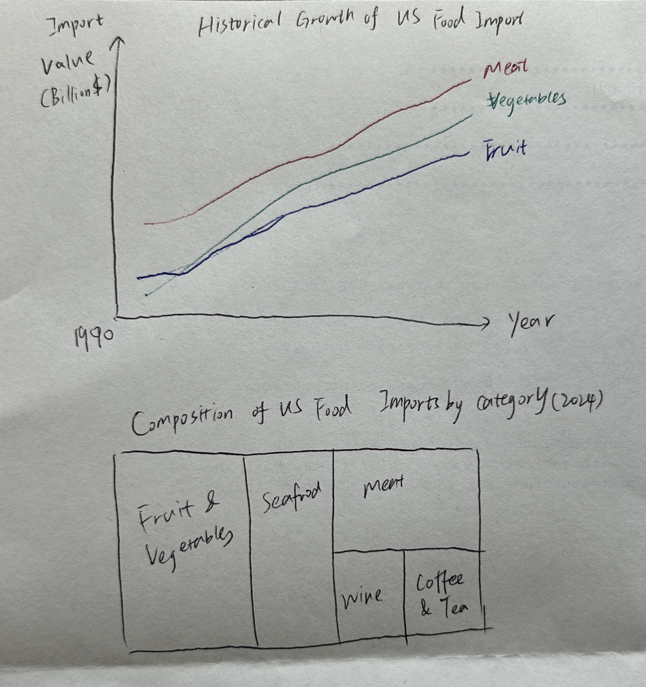

| [home page](https://cmustudent.github.io/tswd-portfolio-templates/) | [data viz examples](dataviz-examples) | [critique by design](critique-by-design) | [final project I](final-project-part-one) | [final project II](final-project-part-two) | [final project III](final-project-part-three) |

# Outline

America's dinner plate increasingly relies on a complex global network of food imports, reflecting changing demographics, evolving tastes, and the realities of a globalized food production system.

## Initial sketches

# The data
Source URL: https://www.ers.usda.gov/data-products/us-food-imports
My primary data source will be the U.S. Food Imports dataset published by the USDA Economic Research Service, which provides comprehensive annual statistics on the value and volume of food products in different categories imported into the United States. This dataset spans at least 20 years, offering valuable long-term trends on import patterns across different food categories and source countries.

# Method and medium
I plan to use this dataset to explore the evolution of America's food import dependencies and how these patterns reflect broader socioeconomic and cultural shifts within the U.S. By analyzing trends in import values across different food categories and source countries. I aim to visualize how factors such as increasing wealth, seasonal availability, and offshore processing have transformed US food system. This analysis will highlight not only changing consumer preferences but also the complex global interconnections that shape our daily food choices.
## References
U.S. Food Imports | Economic Research Service. (2024, October 3). https://www.ers.usda.gov/data-products/us-food-imports

## AI acknowledgements

Use Claude to summarize what the dataset looks like and possible problems to explore in the dataset.
